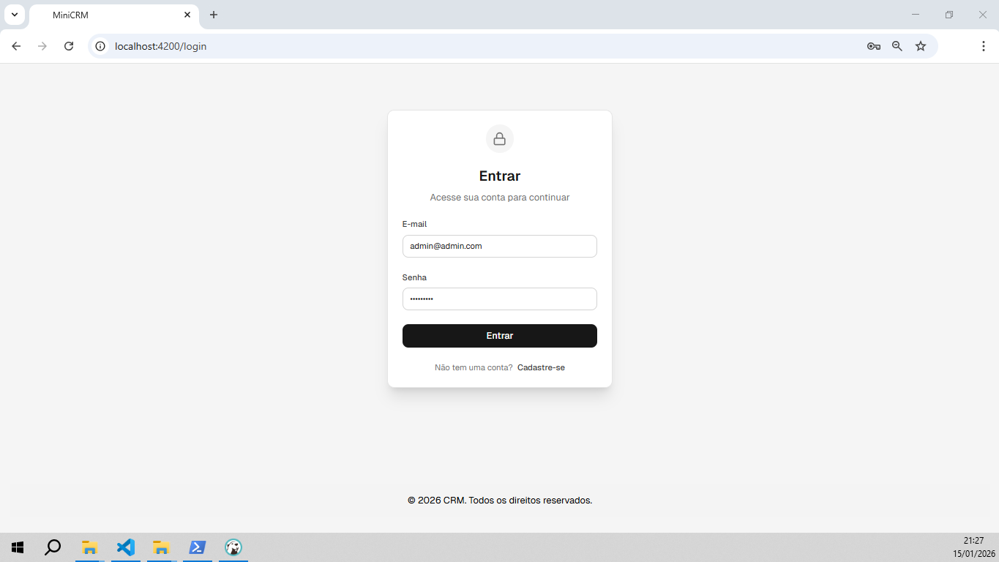
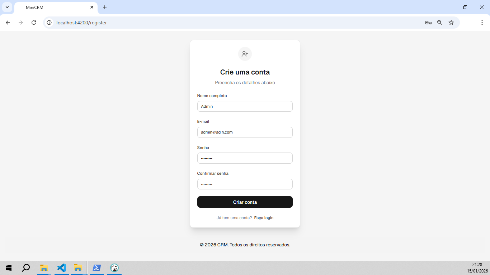
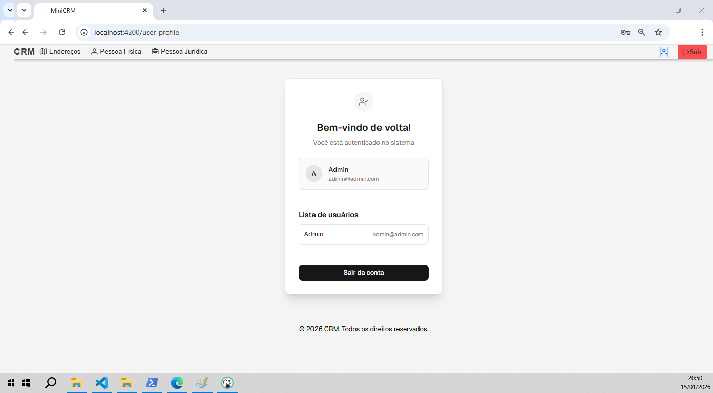
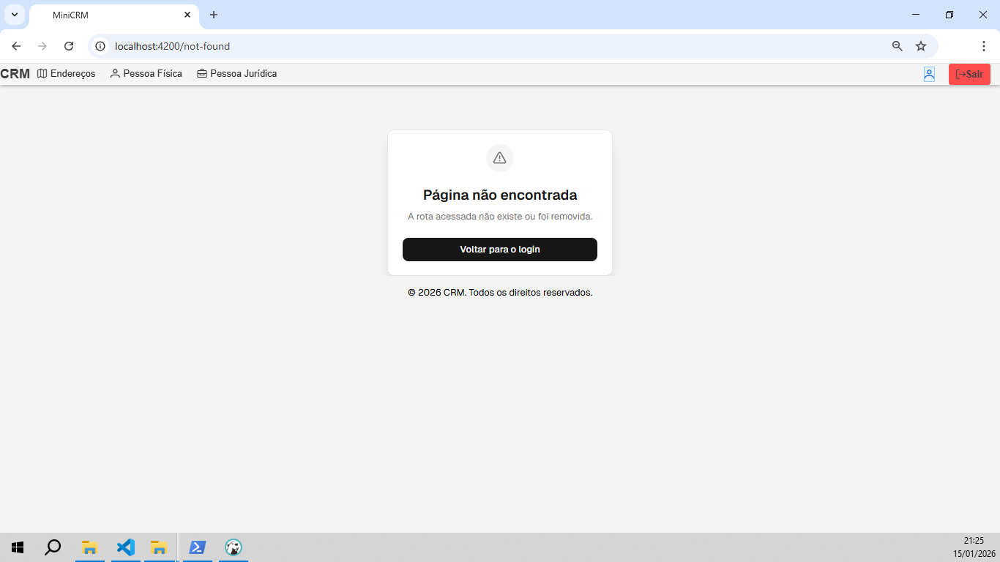
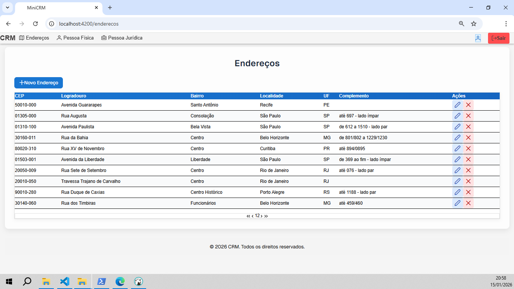
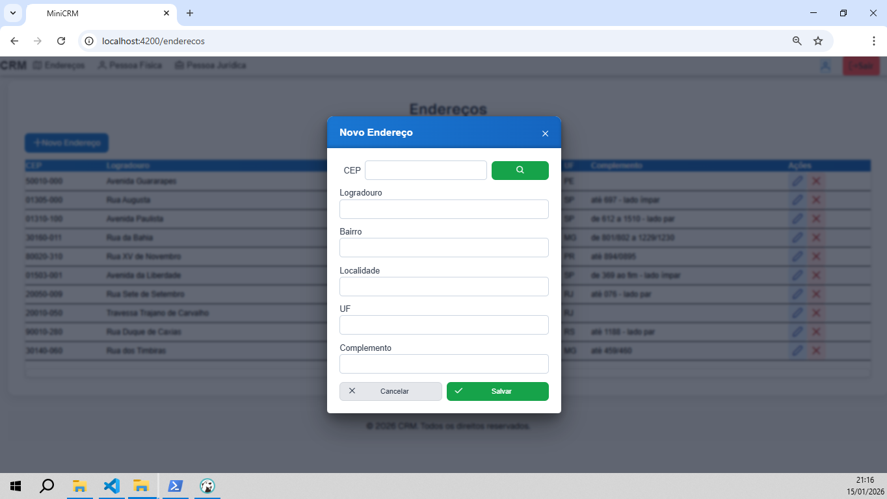
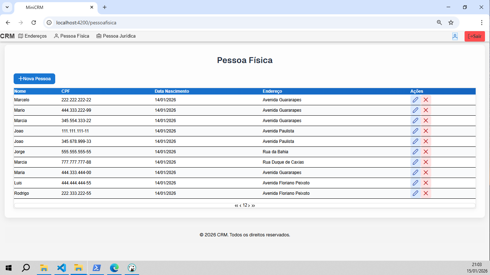
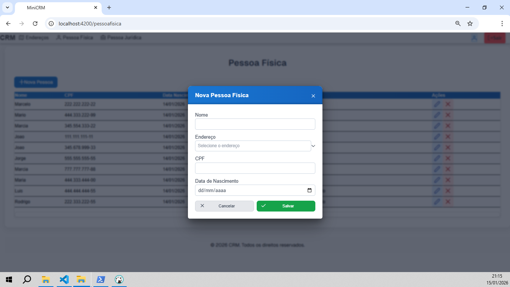
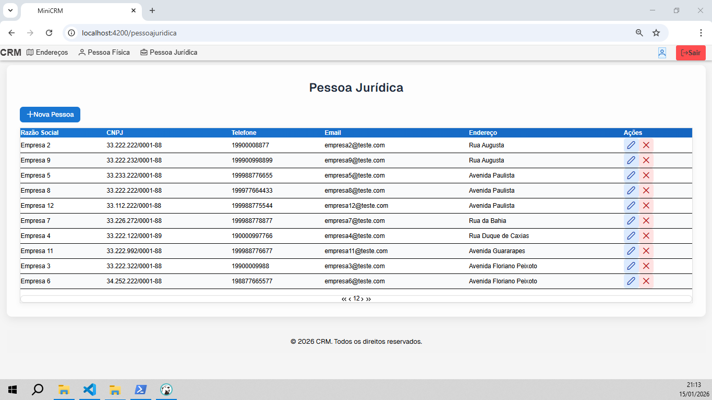

# MiniCRM - Organization Lead | Front-End

Este é o front-end de um sistema web completo, com interface moderna e intuitiva, desenvolvido para proporcionar **uma experiência clara e prática** aos usuários. A aplicação apresenta funcionalidades de autenticação, gestão de usuários, pessoas físicas e jurídicas, além de controle de endereços.

As imagens abaixo mostram as principais telas do sistema:

---

## Login
Tela de autenticação do usuário, com validação e mensagens de feedback.



---

## Registro
Formulário para criar uma nova conta de forma simples e rápida.



---

## Perfil do Usuário
Exibe informações do usuário autenticado e permite gerenciar a sessão.



---

## Página Não Encontrada
Indica quando o usuário acessa uma rota inexistente ou removida, mantendo clareza na navegação.



---

## Gestão de Endereços
- **Lista de Endereços:** Visualize todos os endereços cadastrados.  
- **Novo Endereço:** Adicione novos endereços de forma rápida e prática.

  


---

## Gestão de Pessoas Físicas
- **Lista de Pessoas Físicas:** Consulte os registros existentes.  
- **Nova Pessoa Física:** Cadastre novas pessoas físicas rapidamente.

  


---

## Gestão de Pessoas Jurídicas
- **Lista de Pessoas Jurídicas:** Consulte os registros existentes.  
- **Nova Pessoa Jurídica:** Cadastre novas empresas de forma prática.

  


---

## Tecnologias Utilizadas
A interface foi desenvolvida com **Angular**, estilizada com **Tailwind CSS** para estilização moderna e responsiva, além de **PrimeNG** para componentes avançados e oferecer uma experiência **responsiva, rápida e intuitiva**.

## Pré-requisitos

- [Node.js](https://nodejs.org/en/download) (versão recomendada: 18+)
- [Angular CLI](https://v19.angular.dev/installation) (versão 19+)

## Como Executar

Siga os passos abaixo para executar o projeto:

1. Clone este repositório em sua máquina local:

   ```bash
   git clone https://github.com/andifernandes/mini-crm.git
   ```

2. Acesse a pasta do projeto:

   ```bash
   cd frontend
   ```

3. Instale as dependências:

   ```bash
   npm install
   ```

4. Inicie o servidor de desenvolvimento:

   ```bash
   npm start
   ```

5. Acesse a aplicação em [http://localhost:4200](http://localhost:4200).

## Estrutura do Projeto

O projeto está organizado da seguinte forma:

```plaintext
mini-crm/
└── src/
    ├── app/
    │   ├── core/
    │   │   ├── guards/
    │   │   │   ├── auth/
    │   │   │   └── no-auth/
    │   │   ├── interceptors/
    │   │   │   └── auth/
    │   │   ├── models/
    │   │   └── services/
    │   │       ├── auth/
    │   │       └── token/
    │   ├── features/
    │   │   ├── login/
    │   │   ├── not-found/
    │   │   ├── register/
    │   │   └── user-profile/
    │   │       └── components/
    │   │           └── logout-dialog/
    │   ├── shared/
    │   │   └── validators/
    │   ├── app.component.*
    │   ├── app.config.ts
    │   └── app.routes.ts
    ├── index.html
    ├── main.ts
    └── styles.css
```

Cada funcionalidade é independente, focada em uma única responsabilidade e utiliza signals para o gerenciamento de estado. O sistema de autenticação garante segurança e persistência dos tokens JWT.
